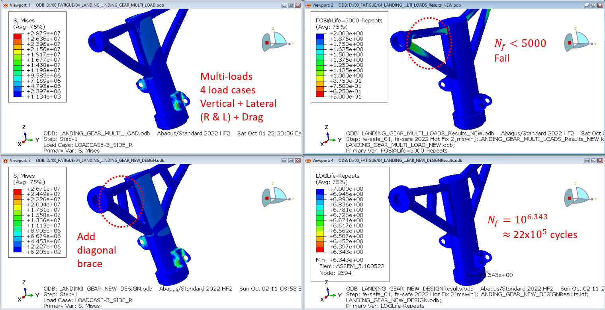

# FEM_COMP_FATIGUE
Repository for sharing the example cases for composite and fatigue analyses using Abaqus/Standard/Explicit/CAE, and FE-Safe.

# Examples:
**Progressive Damage Analysis, Composite**

**Landig Gear - Multiload: FE-Safe**

**Fiber Broken - Continum Shell & Hashin Criteria**

**Composite Failure: Subroutine-USDFLD**

**Goodman Mean-stress Effect: FE-Safe**

**Composite Specimen Crack Propagation using XFEM**

**Sandwich Form Crack Initiation using XFEM**

**Low-cycle Fatigue**

